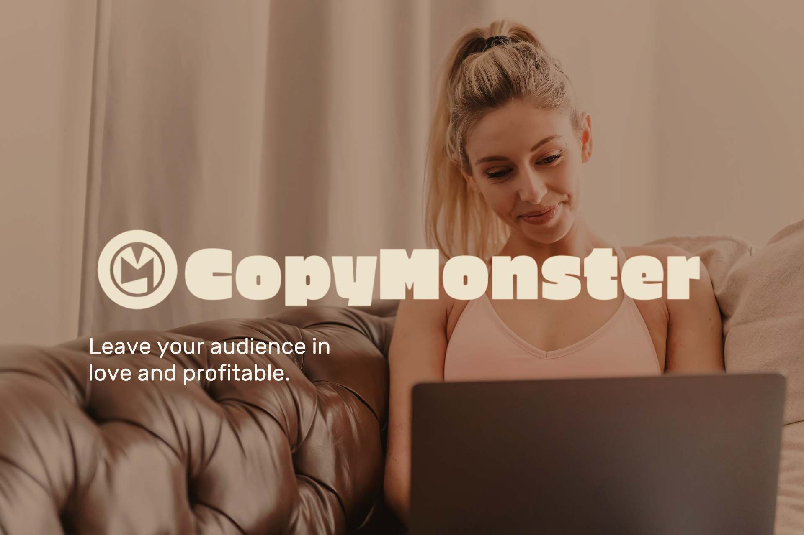

<div align="center">
  <h1>🧬 CopyMonster</h1>
  <p><strong>The only open-source AI copy platform that forces you to map your Brand DNA before writing a single word.</strong></p>
  <p><em>Copy that converts — because it's built on strategy, not generic prompts.</em></p>
  <br/>
  
  
  
  
  
  
  <br/><br/>
  <a href="https://copymonster.me">Website</a> · 
  <a href="https://copymonster.me/docs">Docs</a> · 
  <a href="https://app.copymonster.me">Cloud</a> · 
  <a href="mailto:enterprise@copymonster.me">Enterprise</a></div><br/><br/>
  
  <br/><br/>
</div>

---

## Why CopyMonster?

Most AI copy tools are closed black boxes that don't know your brand. You paste a prompt, get generic output, and tweak it forever.

**CopyMonster takes the opposite path:** you cannot generate a single line of copy until your 12-block Brand DNA is mapped. Every agent — Hook, Headline, VSL, Email, Ads — reads from that DNA.

The result? Copy that sounds like your brand, because the strategy was defined **before** the words.

- 🧬 **Brand DNA first** — 12 structured blocks (6 structural, 6 adaptive), versioned like code.
- 🤖 **Multi-agent system** — specialist agents, each with its own prompt, model, and few-shots.
- 📊 **Meta Ads loop** — connect Meta Ads & Instagram and feed real performance back into the DNA.
---

st AI copy tools are closed black boxes that don't know your brand. You
paste a prompt, get generic output, and tweak it forever. CopyMonster takes
the opposite path: **you cannot generate a single line of copy until your
12-block Brand DNA is mapped**. Every agent — Hook, Headline, VSL, Email,
Ads — reads from that DNA. The result is copy that sounds like your brand,
because the strategy was defined before the words.

- **Brand DNA first** — 12 structured blocks (6 structural, 6 adaptive), versioned like code.
- **Multi-agent system** — specialist agents, each with its own prompt, model, and few-shots.
- **Meta Ads loop** — connect Meta Ads & Instagram and feed real performance back into the DNA.
- **MIT licensed** — self-host, fork, audit every prompt.
- **BYO LLM** — Lovable AI Gateway, OpenAI, Anthropic, OpenRouter, Mistral, or local Ollama.
- **Multilingual** — PT, EN, ES out of the box.

> The open-source alternative to **Jasper, Copy.ai and AdCreative.ai**.

---

## DNA First — the core of CopyMonster

CopyMonster is built around a single, opinionated rule:

> **No DNA → no copy.**

When a user signs up, the app guides them through the **12-block Brand DNA**
before any agent is unlocked. Each block captures a strategic dimension of
the brand (voice, audience, offer, mechanism, objections, proof, etc.).
The DNA is versioned, comparable, and re-usable across every agent.

| Layer | Blocks | Editable by |
|---|---|---|
| **Structural** | Voice, Audience, Offer, Mechanism, Promise, Positioning | Human (locked once approved) |
| **Adaptive**   | Hooks, Objections, Proofs, Angles, CTAs, Tone shifts | Human in Core · AI in Enterprise |

In the **Core**, the user updates the adaptive layer manually.
In **Enterprise**, the **DNA Intelligence Engine** evolves it automatically
from real Meta Ads performance (ROAS, CTR, hook retention, etc.).

This is the differentiator no other open-source or commercial tool ships
today.

---

## Quickstart — Docker

```bash
git clone https://github.com/YOUR_USER/copymonster.git
cd copymonster
cp .env.example .env   # fill in your Supabase keys
docker compose up -d --build
# → http://localhost:3030
```

## Quickstart — Cloudflare Pages

1. Fork this repo.
2. Cloudflare Dashboard → Pages → **Connect to Git**.
3. Build settings:
   - Framework preset: **Vite**
   - Build command: `npm run build`
   - Build output: `dist`
   - Node version: `18`
4. Environment variables (Production & Preview):
   - `VITE_SUPABASE_URL`
   - `VITE_SUPABASE_PUBLISHABLE_KEY`
   - `VITE_SUPABASE_PROJECT_ID`
   - `VITE_STRIPE_PUBLISHABLE_KEY` _(optional)_
5. Add `public/_redirects` with `/*    /index.html   200` for SPA fallback.
6. Add your custom domain in Pages → Custom domains.

---

## Tech Stack

React 18 · Vite 5 · TypeScript 5 · Tailwind CSS 3 · shadcn/ui (Radix) ·
TanStack Query · React Hook Form + Zod · i18next · Framer Motion ·
Lucide Icons · Recharts · Sonner · Supabase (Postgres 15, Auth, Storage,
Edge Functions) · pg_cron · pg_net · pgcrypto · Stripe · Meta Graph API.

---

## Supported LLM Providers

CopyMonster is **BYO LLM**. Configure providers via Supabase Edge Function
secrets (never in the committed `.env`).

| Provider | Status | Secret name |
|---|---|---|
| Lovable AI Gateway (default, proxies OpenAI/Anthropic/Google) | Wired | `LOVABLE_API_KEY` |
| OpenAI | Wired | `OPENAI_API_KEY` |
| Anthropic | Wired | `ANTHROPIC_API_KEY` |
| OpenRouter | Documented — community PRs welcome | `OPENROUTER_API_KEY` |
| Mistral | Documented — community PRs welcome | `MISTRAL_API_KEY` |
| Ollama (local) | Documented — community PRs welcome | `OLLAMA_BASE_URL` |

See [CONTRIBUTING.md](./CONTRIBUTING.md#adding-a-new-llm-provider) for the
integration contract.

---

## Comparison

| | CopyMonster | Jasper | Copy.ai | AdCreative.ai | Anyword |
|---|:-:|:-:|:-:|:-:|:-:|
| Open Source (MIT) | ✅ | ❌ | ❌ | ❌ | ❌ |
| Self-hostable | ✅ | ❌ | ❌ | ❌ | ❌ |
| **DNA-first workflow** (mandatory) | ✅ | ❌ | ❌ | ❌ | ❌ |
| Brand voice versioning | ✅ | ⚠️ | ⚠️ | ❌ | ⚠️ |
| Meta Ads integration | ✅ | ❌ | ❌ | ✅ | ❌ |
| Performance → DNA loop | ✅ | ❌ | ❌ | ❌ | ⚠️ |
| BYO LLM | ✅ | ❌ | ❌ | ❌ | ❌ |
| Multi-agent (configurable) | ✅ | ⚠️ | ✅ | ❌ | ❌ |
| Starts at | **$0** | $49 | $49 | $39 | $49 |

---

## Core vs Enterprise

| Feature | Core (MIT) | Enterprise |
|---|:-:|:-:|
| 12-block Brand DNA (mandatory entry point) | ✅ | ✅ |
| DNA versioning, comparison, export | ✅ | ✅ |
| All public AI agents | ✅ | ✅ |
| Chat with agents, Library, Gamification | ✅ | ✅ |
| i18n (PT / EN / ES) | ✅ | ✅ |
| BYO LLM (OpenAI / Anthropic / OpenRouter / Mistral / Ollama) | ✅ | ✅ |
| Basic Meta Ads connection | ✅ | ✅ |
| **DNA Intelligence Engine** (automatic DNA evolution) | — | ✅ |
| Additional Intelligence products (A/B variants, more tests) | — | ✅ |
| **Market Radar** | — | ✅ |
| Advanced Meta Ads (multi-account, IG insights, deep metrics) | — | ✅ |
| Multi-tenant / Workspaces | — | ✅ |
| SSO (Google Workspace, Okta, Azure AD) | — | ✅ |
| White-label | — | ✅ |
| Admin Panel (full) | — | ✅ |
| SLA & priority support | — | ✅ |

---

## Pricing

| Plan | Price | Best for |
|---|---|---|
| **Core (MIT)** | **$0** | Devs, indies, self-hosted teams |
| Starter Cloud | $47/mo | Freelance copywriters |
| Pro Cloud | $97/mo | Small agencies |
| Legend Cloud | $197/mo | Mid-size agencies |
| **Enterprise Cloud** | **$1,500+/mo** | Holdings, in-house teams |
| **Enterprise Self-Hosted** | **$8k–$20k/yr** | Compliance / data-sensitive orgs |

---

## Roadmap

- [ ] Wire OpenRouter, Mistral, and Ollama providers in edge functions
- [ ] Plugin SDK for community agents
- [ ] Google Ads integration
- [ ] TikTok Ads integration
- [ ] Headless CLI for DNA generation
- [ ] Public benchmarks of agent prompts

---

## Community & Support

- Email: hello@copymonster.me
- Security: security@copymonster.me — see [SECURITY.md](./SECURITY.md)
- Enterprise: enterprise@copymonster.me

Contributions are welcome — start with [CONTRIBUTING.md](./CONTRIBUTING.md).

---

## Enterprise

Features available in the Enterprise plan:
- Multi-tenant (multiple workspaces)
- SSO
- White-label
- Automatic DNA evolution
- Priority support

**Contact:** enterprise@copymonster.me

---

## License

[MIT](./LICENSE) for the Core. Enterprise modules are governed by a
separate commercial license — see the Enterprise section above.
